<!-- PORTRAIT - generated by scripts/dotify.py from assets/jacket.png.
     Colour mode, so one file serves both GitHub themes. Regenerate with:
       python scripts/dotify.py assets/jacket.png -o assets/portrait \
         --cols 100 --equalize --detail 0.5 --color -->

 

<!-- NAME / TAGLINE - animated typing -->

 

<!-- SOCIALS -->

## `~/` toolbox

---

<table>
<tr>
<td width="50%" align="center" valign="middle">

<!-- Self-rated radar - edit assets/skills.json, the workflow redraws it -->
<picture>
  <source media="(prefers-color-scheme: dark)"  srcset="assets/radar-dark.svg">
  <source media="(prefers-color-scheme: light)" srcset="assets/radar-light.svg">
  
</picture>

</td>
<td width="50%" align="center" valign="middle">

<!-- Live radar built from real language byte counts across your repos -->
<picture>
  <source media="(prefers-color-scheme: dark)"  srcset="assets/radar-langs-dark.svg">
  <source media="(prefers-color-scheme: light)" srcset="assets/radar-langs-light.svg">
  
</picture>

</td>
</tr>
</table>

---

<!-- Cards generated by scripts/cards.py from assets/projects.json.
     Stars, forks and language are pulled live from the API on every run. -->
<table>
<tr>
<td width="50%">
  <a href="https://github.com/YOUR_USERNAME/PROJECT_ONE">
    <picture>
      <source media="(prefers-color-scheme: dark)"  srcset="assets/card-PROJECT_ONE-dark.svg">
      <source media="(prefers-color-scheme: light)" srcset="assets/card-PROJECT_ONE-light.svg">
      
    </picture>
  </a>
</td>
<td width="50%">
  <a href="https://github.com/YOUR_USERNAME/PROJECT_TWO">
    <picture>
      <source media="(prefers-color-scheme: dark)"  srcset="assets/card-PROJECT_TWO-dark.svg">
      <source media="(prefers-color-scheme: light)" srcset="assets/card-PROJECT_TWO-light.svg">
      
    </picture>
  </a>
</td>
</tr>
<tr>
<td width="50%">
  <a href="https://github.com/YOUR_USERNAME/PROJECT_THREE">
    <picture>
      <source media="(prefers-color-scheme: dark)"  srcset="assets/card-PROJECT_THREE-dark.svg">
      <source media="(prefers-color-scheme: light)" srcset="assets/card-PROJECT_THREE-light.svg">
      
    </picture>
  </a>
</td>
<td width="50%">
  <a href="https://github.com/YOUR_USERNAME/PROJECT_FOUR">
    <picture>
      <source media="(prefers-color-scheme: dark)"  srcset="assets/card-PROJECT_FOUR-dark.svg">
      <source media="(prefers-color-scheme: light)" srcset="assets/card-PROJECT_FOUR-light.svg">
      
    </picture>
  </a>
</td>
</tr>
</table>

---

`01110100 01101000 01100001 01101110 01101011 01110011 00100000 01100110 01101111 01110010 00100000 01110011 01100011 01110010 01101111 01101100 01101100 01101001 01101110 01100111`

